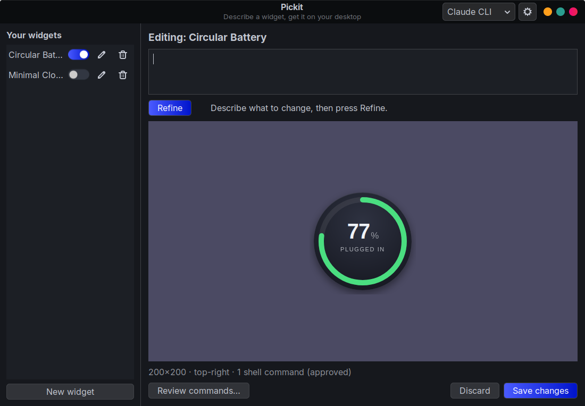
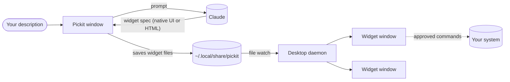

<div align="center">


# Pickit

**Describe a desktop widget in plain words, and get it on your Linux desktop.**

[](https://github.com/dengo07/pickit/actions/workflows/ci.yml)
[](https://github.com/dengo07/pickit/releases/latest)
[](LICENSE)




</div>

> *"A translucent clock with CPU and RAM bars in the bottom-right corner."*
> Press **Generate**, and a few seconds later it's on your desktop.

Pickit uses Claude to turn your description into a working widget, then pins it to your desktop like a native desklet. You can refine a widget by asking for changes ("make it bigger and blue") until it looks right.

## Features

- **Plain-language widgets.** Clocks, system meters, weather, now playing, timers, battery gauges and more.
- **Part of the desktop.** Widgets sit above the wallpaper and below every window. Show Desktop doesn't hide them, they appear on every workspace, and they stay out of the taskbar and Alt+Tab.
- **Always on.** Widgets keep running after you close Pickit and come back after a reboot.
- **Live data, with approval.** Widgets get data from shell commands that **you approve before they run**. Change a command and Pickit asks again.
- **No setup.** Download a Flatpak or AppImage; there are no libraries to install. Pickit uses your [Claude Code](https://claude.com/claude-code) login if you have one, or an Anthropic API key.
- **Light on memory.** Most widgets are drawn natively with GTK: five typical widgets use about 25 MB in total. When a design needs more freedom (animation, SVG art), Pickit switches to HTML/CSS for that widget.
- **Hackable.** Every widget is a small JSON or HTML file you can open and edit yourself.

## Install

**[⬇ Install Pickit](https://dengo07.github.io/pickit/Pickit.flatpakref)**: open the downloaded file, and your software center (Linux Mint Software Manager, GNOME Software or KDE Discover) shows an **Install** button. Updates then arrive through your normal software updates.

Or from a terminal:

```bash
flatpak install https://dengo07.github.io/pickit/Pickit.flatpakref
```

<details>
<summary><b>Other options: AppImage or offline bundle</b></summary>

| Package | Install |
|---|---|
| [`Pickit-x86_64.AppImage`](https://github.com/dengo07/pickit/releases/latest/download/Pickit-x86_64.AppImage) | A single file, nothing installed. Browsers save downloads as non-executable, so first right-click → **Properties** → **Permissions** → **Allow executing file as program**, then double-click it. From a terminal: `chmod +x Pickit-x86_64.AppImage && ./Pickit-x86_64.AppImage`. It adds itself to your app menu. |
| [`Pickit.flatpak`](https://github.com/dengo07/pickit/releases/latest/download/Pickit.flatpak) | An offline bundle, for installing without internet access: `flatpak install Pickit.flatpak`. It doesn't update itself. |

</details>

- **Flatpak** works on any distro with Flatpak. It's preinstalled on Linux Mint, Fedora, Pop!_OS, Zorin, elementary and Steam Deck; on Ubuntu or Debian, run `sudo apt install flatpak` first.
- **AppImage** needs glibc 2.39 or newer: Ubuntu 24.04+, Mint 22+, Fedora 40+, Debian 13+, Arch, openSUSE Tumbleweed.

All versions share the same widgets and settings, so you can switch between them.

The Flatpak installs system-wide, like the apps from your software center, so it **reuses the runtimes and graphics drivers you already have**. The first time, it downloads anything missing: the GNOME runtime (about 400 MB, shared with every GNOME Flatpak app) and, on NVIDIA systems, Flatpak's copy of your driver version. Later updates only download Pickit itself (about 5 MB).

### Connect to Claude

When you first press **Generate**, Pickit picks one of these automatically:

1. **Claude Code**: if the `claude` command is installed and logged in, Pickit uses it. No key needed.
2. **Anthropic API**: otherwise, enter an API key from [console.anthropic.com](https://console.anthropic.com) in **Settings**.

## Usage

1. Open **Pickit** and describe your widget, or pick one of the examples.
2. Press **Generate** (or <kbd>Ctrl</kbd>+<kbd>Enter</kbd>).
3. If the widget needs live data, review the shell commands it wants to run and approve them.
4. Refine it: *"use a serif font"*, *"add seconds"*, *"make the ring orange"*.
5. Press **Place on desktop**.

On the desktop:

| Action | How |
|---|---|
| Move a widget | <kbd>Alt</kbd>+drag, or drag its handle area |
| Edit, reload, hide or delete | Right-click the widget |
| Show or hide widgets | The switches in Pickit's sidebar |

### Command line

```text
pickit                      open the maker window
pickit new "a pomodoro timer with a progress ring"
pickit edit <id>            open a widget in the maker
pickit list                 list your widgets
pickit run | stop           start or stop the desktop daemon (normally automatic)
```

For the Flatpak, use `flatpak run io.github.dengo07.Pickit <command>`.

## How it works



- Each widget uses one of two engines. **Native** widgets are a JSON component tree (cards, labels, rings, bars, images, buttons, with data bindings) that Pickit draws with GTK. **HTML** widgets are a web page drawn by WebKit, for designs native can't express. Either way the widget sits in a transparent window that the window manager keeps in the desktop layer.
- A separate **desktop daemon** owns the widget windows. It starts at login and picks up changes as soon as you save them, which is why widgets survive closing the app.
- Widgets can only run the shell commands listed in their manifest, and only after you approve them. See [SECURITY.md](SECURITY.md).

More detail: [architecture](docs/ARCHITECTURE.md) · [widget format and JS API](docs/WIDGET_FORMAT.md) · [packaging](docs/PACKAGING.md)

## Compatibility

| Desktop | Status |
|---|---|
| Cinnamon (X11) | ✅ Tested |
| MATE, Xfce, Budgie, KDE Plasma, GNOME (X11) | Expected to work; please report issues |
| Wayland sessions | Runs through XWayland automatically; untested |

Widgets need a compositing window manager for transparency. Most desktops have one enabled by default; on Xfce, turn it on in Window Manager Tweaks.

## Troubleshooting

<details>
<summary><b>A widget is blank or invisible</b></summary>

Right-click where the widget should be and choose **Reload**. If it's still blank, look at `~/.local/share/pickit/daemon.log`. Transparency needs a compositor to be running.
</details>

<details>
<summary><b>"Connect Pickit to Claude"</b></summary>

Pickit found neither the `claude` command nor an API key. Install and log in to Claude Code, or add an Anthropic API key in **Settings**.
</details>

<details>
<summary><b>A widget shows no data</b></summary>

Its commands may not be approved yet (right-click → **Review commands…**), or a tool it relies on (for example `playerctl` or `sensors`) isn't installed. Ask Pickit to "work without playerctl", or install the tool.
</details>

<details>
<summary><b>Widgets don't come back after a reboot</b></summary>

Check that **Settings → Keep widgets on the desktop after reboot** is on. It creates `~/.config/autostart/pickit.desktop`.
</details>

## Development

Run from source on Debian, Ubuntu or Mint:

```bash
sudo apt install python3-gi python3-gi-cairo gir1.2-gtk-3.0 gir1.2-webkit2-4.1
git clone https://github.com/dengo07/pickit && cd pickit
python3 -m pickit            # optional: ./install.sh adds a menu entry
pip install anthropic        # only needed for the Anthropic API backend
```

Tests and lint (no display needed):

```bash
pip install pytest ruff
pytest && ruff check .
```

Build the release packages with `make flatpak` and `make appimage` (see [docs/PACKAGING.md](docs/PACKAGING.md)).

Contributions are welcome. Please read [CONTRIBUTING.md](CONTRIBUTING.md).

## License

[MIT](LICENSE) © 2026 Deniz Ural
