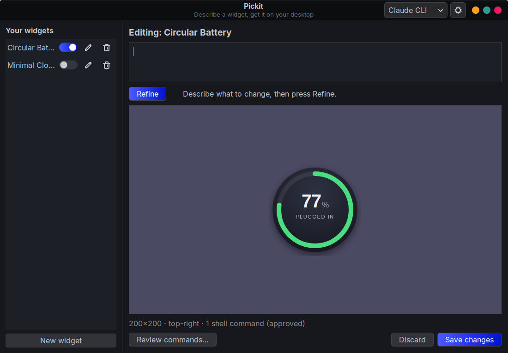
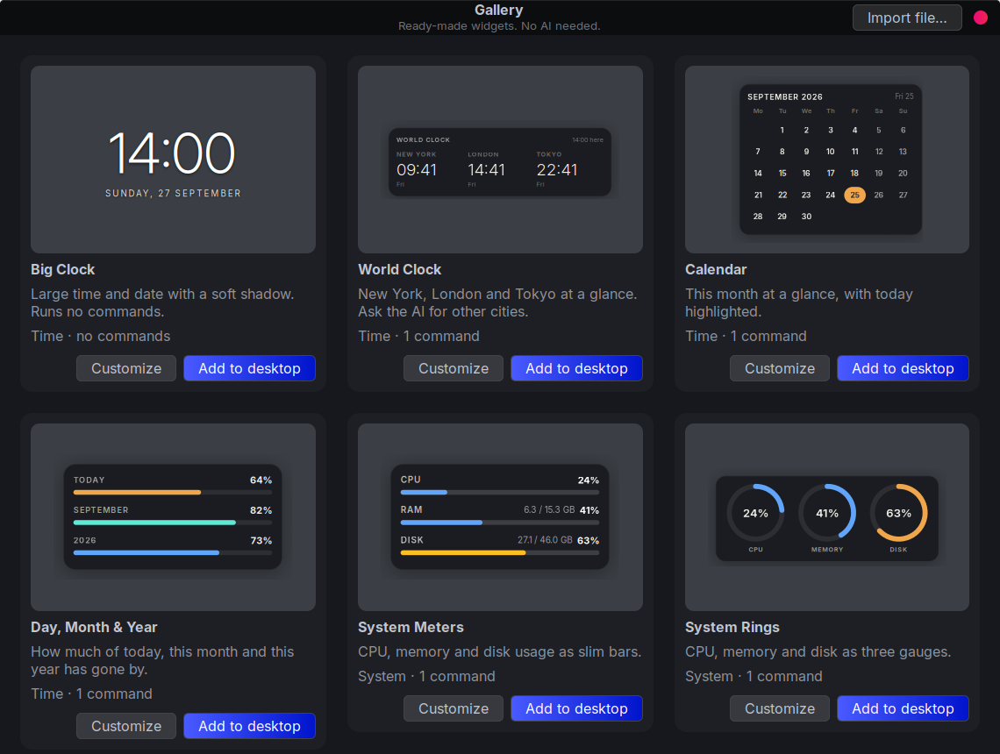
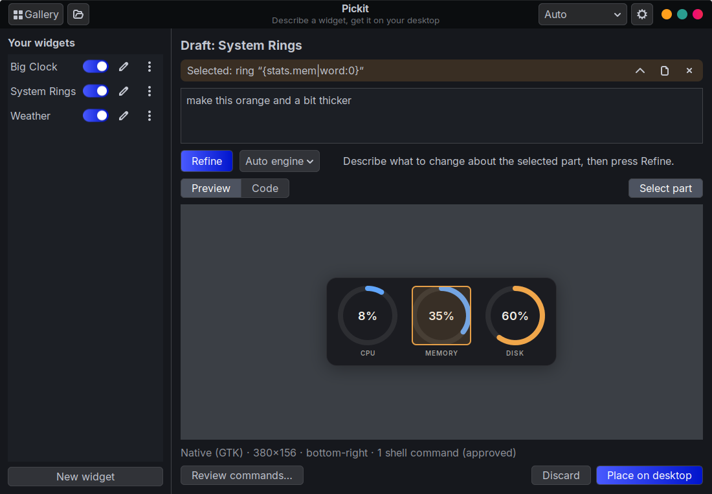
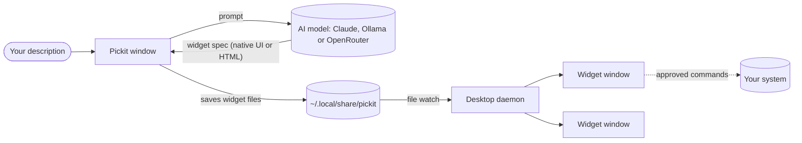

<div align="center">


# Pickit

**Describe a desktop widget in plain words, and get it on your Linux desktop.**

## Example desktop with widgets made with pickit(Including the cats :) )


-----------------------------------------------------------------------------------------------------------------------------------------------------------------------------------
----------------------------------------------------------------------------------------------------------------------------------------------------------------------------------

[](https://github.com/dengo07/pickit/actions/workflows/ci.yml)
[](https://github.com/dengo07/pickit/releases/latest)
[](LICENSE)




</div>

> *"A translucent clock with CPU and RAM bars in the bottom-right corner."*
> Press **Generate**, and a few seconds later it's on your desktop.

Pickit uses an AI model to turn your description into a working widget, then pins it to your desktop like a native desklet. Use Claude, a free local model through Ollama, or any model on OpenRouter. You can refine a widget by asking for changes ("make it bigger and blue") until it looks right.

## Features

- **Plain-language widgets.** Clocks, system meters, weather, now playing, timers, battery gauges and more.
- **A gallery of ready-made widgets.** Thirteen widgets you can add in one click, no AI needed: clocks, a calendar, system gauges and graphs, network speed, CPU temperature, weather and now playing.
- **Change any part.** Press **Select part**, click a piece of the widget and say what to change about it, or open the **Code** tab and edit the widget directly.
- **One theme for all widgets.** Pick a preset or your own colors, corner radius and font, in dark, light or following the desktop, and every widget restyles at once. The **inspector** changes a part's colors, sizes and text by hand, no AI needed.
- **Widgets that open up.** Ask for an expandable widget, such as a clock that opens to show your agenda: click it to show more, click again to fold it away.
- **Share widgets.** Export any widget as a `.pickit` file; others open it with a double-click and approve its commands before anything runs.
- **Part of the desktop.** Widgets sit above the wallpaper and below every window. Show Desktop doesn't hide them, they appear on every workspace, and they stay out of the taskbar and Alt+Tab.
- **Always on.** Widgets keep running after you close Pickit and come back after a reboot.
- **Live data, with approval.** Widgets get data from shell commands that **you approve before they run**. Change a command and Pickit asks again. The approval dialog points out risky commands, and **Settings** can run every command in a restricted sandbox, away from your files.
- **No setup.** Download a Flatpak or AppImage; there are no libraries to install.
- **Your choice of AI.** Your [Claude Code](https://claude.com/claude-code) login, an Anthropic API key, a local model with [Ollama](https://ollama.com) (free, and nothing leaves your computer), or any model on [OpenRouter](https://openrouter.ai).
- **Light on memory.** Most widgets are drawn natively with GTK: five typical widgets use about 25 MB in total. When a design needs more freedom (animation, SVG art), Pickit switches to HTML/CSS for that widget.
- **Hackable.** Every widget is a small JSON or HTML file you can open and edit yourself.

## Install

**[⬇ Install Pickit](https://dengo07.github.io/pickit/Pickit.flatpakref)**: open the downloaded file, and your software center (Linux Mint Software Manager, GNOME Software or KDE Discover) shows an **Install** button. Updates then arrive through your normal software updates.

Or from a terminal:

```bash
flatpak install https://dengo07.github.io/pickit/Pickit.flatpakref
```

<details>
<summary><b>Other options: AppImage or offline bundle</b></summary>

| Package | Install |
|---|---|
| [`Pickit-x86_64.AppImage`](https://github.com/dengo07/pickit/releases/latest/download/Pickit-x86_64.AppImage) | A single file, nothing installed. Browsers save downloads as non-executable, so first right-click → **Properties** → **Permissions** → **Allow executing file as program**, then double-click it. From a terminal: `chmod +x Pickit-x86_64.AppImage && ./Pickit-x86_64.AppImage`. It adds itself to your app menu. |
| [`Pickit.flatpak`](https://github.com/dengo07/pickit/releases/latest/download/Pickit.flatpak) | An offline bundle, for installing without internet access: `flatpak install Pickit.flatpak`. It doesn't update itself. |

</details>

- **Flatpak** works on any distro with Flatpak. It's preinstalled on Linux Mint, Fedora, Pop!_OS, Zorin, elementary and Steam Deck; on Ubuntu or Debian, run `sudo apt install flatpak` first. The Flatpak sandbox doesn't contain widget commands or the Claude Code CLI: they run on your system after you approve them (see [SECURITY.md](SECURITY.md)).
- **AppImage** needs glibc 2.39 or newer: Ubuntu 24.04+, Mint 22+, Fedora 40+, Debian 13+, Arch, openSUSE Tumbleweed.

All versions share the same widgets and settings, so you can switch between them.

The Flatpak installs system-wide, like the apps from your software center, so it **reuses the runtimes and graphics drivers you already have**. The first time, it downloads anything missing: the GNOME runtime (about 400 MB, shared with every GNOME Flatpak app) and, on NVIDIA systems, Flatpak's copy of your driver version. Later updates only download Pickit itself (about 5 MB).

### Connect an AI model

To generate your own widgets, Pickit needs one of these (the gallery works without any). With the backend set to **Automatic**, it uses the first one it finds, in this order:

| Backend | Setup | Notes |
|---|---|---|
| **Claude Code** | Install the `claude` command and log in. | Uses your Claude subscription; no key needed. |
| **Anthropic API** | Add a key from [console.anthropic.com](https://console.anthropic.com) in **Settings**. | Pay per use. |
| **Ollama** | Install [Ollama](https://ollama.com), then download a model: `ollama pull qwen3.5:9b`. | Free and private: the model runs on your computer. A graphics card with 8 GB of memory runs 8–9B models well; bigger models write better widgets. |
| **OpenRouter** | Add a key from [openrouter.ai/keys](https://openrouter.ai/keys) in **Settings** and pick a model. | Hundreds of models through one key, including free ones (their IDs end in `:free`). |

Open **Settings** (the gear button) to choose a backend and model, and press **Test connection** to check it. You can also switch backends from the menu next to the gear.

## Usage



**No AI set up yet?** Press **Gallery**, pick a widget and press **Add to desktop**. **Customize** opens it in the editor first, so you can refine it with AI later.

To make your own:

1. Open **Pickit** and describe your widget, or pick one of the examples.
2. Press **Generate** (or <kbd>Ctrl</kbd>+<kbd>Enter</kbd>).
3. If the widget needs live data, review the shell commands it wants to run and approve them.
4. Refine it: *"use a serif font"*, *"add seconds"*, *"make the ring orange"*.
5. Press **Place on desktop**.

### Customize a widget



- **Change one part.** Press **Select part** and click a piece of the widget in the preview: a label, a ring, a whole card. ↑ selects the part around it. Then describe the change (*"make this orange"*, *"hide this when unplugged"*) and press **Refine**. The AI changes that part and leaves the rest alone.
- **Fine-tune it by hand.** When a part of a native widget is selected, the inspector next to the preview shows its properties: pick a color (or one of the theme's colors, so it follows theme changes), set a size, switch a property on or off. **Add property** sets one that isn't set yet, and × goes back to the default. The preview updates as you go.
- **Theme all your widgets.** Press **Theme** in the header: choose a preset (Charcoal, Graphite, Forest or Paper), dark, light or **Follow the desktop**, and change any color, the corner radius or the font. A live preview shows the result; **Apply** restyles every widget on your desktop. Widgets made before Pickit 1.5.0 keep their own colors.
- **Undo any change.** **Undo** and **Redo** (<kbd>Ctrl</kbd>+<kbd>Z</kbd>, <kbd>Ctrl</kbd>+<kbd>Shift</kbd>+<kbd>Z</kbd>) step through AI refines, inspector changes and code edits. Pickit keeps the last 10 saved versions of every widget, so Undo also works after you reopen one.
- **Edit the code.** The **Code** tab shows the widget as code: its layout (the component tree, or the HTML page) and its settings and shell commands. Edit either one and press **Apply** (<kbd>Ctrl</kbd>+<kbd>S</kbd>). Pickit checks it like AI output and points at the problem if there is one. Changed commands need your approval again. The file icon on a selection jumps to its code.

Open any widget on your desktop with its ✎ button in the sidebar, or **Edit…** in its right-click menu.

On the desktop:

| Action | How |
|---|---|
| Move a widget | <kbd>Alt</kbd>+drag, or drag its handle area |
| Keep it from moving | Right-click → **Lock position**, or lock them all in **Settings** |
| Let clicks pass through it | Right-click → **Click-through** (turn it off from ⋮ in Pickit's sidebar) |
| Put it on another screen | Right-click → **Move to monitor** (with two or more monitors) |
| Edit, reload, hide or delete | Right-click the widget |
| Show or hide widgets | The switches in Pickit's sidebar |
| Share a widget | Right-click it → **Export…**, or ⋮ → **Export…** in the sidebar |

### Share widgets

**Export…** saves a widget as a small `.pickit` file. Send it to a friend, post it in an issue or a Reddit comment. To use one, double-click it (or press the open-file button in Pickit): Pickit shows a preview and asks you to approve its shell commands, just like a generated widget. Files carry no approval, no screen position and none of your prompts. See [the file format](docs/WIDGET_FORMAT.md#pickit-files).

### Command line

```text
pickit                      open the maker window
pickit new "a pomodoro timer with a progress ring"
pickit edit <id>            open a widget in the maker
pickit gallery              browse ready-made widgets
pickit list                 list your widgets
pickit export <id> [FILE]   save a widget as a .pickit file
pickit import FILE          open a .pickit file
pickit run | stop           start or stop the desktop daemon (normally automatic)
```

For the Flatpak, use `flatpak run io.github.dengo07.Pickit <command>`. The Flatpak can only read and write files you pick in a file dialog, so export and import from the Pickit window (or double-click a `.pickit` file) rather than with `pickit export`/`import`.

## How it works


```mermaid
flowchart LR
  you([Your description]) --> maker[Pickit window]
  maker -- prompt --> ai[("AI model: Claude, Ollama or OpenRouter")]
  ai -- "widget spec (native UI or HTML)" --> maker
  maker -- "saves widget files" --> store[("~/.local/share/pickit")]
  store -- "file watch" --> daemon[Desktop daemon]
  daemon --> w1[Widget window]
  daemon --> w2[Widget window]
  w1 -. "approved commands" .-> host[(Your system)]
```

- Each widget uses one of two engines. **Native** widgets are a JSON component tree (cards, labels, rings, bars, images, buttons, with data bindings) that Pickit draws with GTK. **HTML** widgets are a web page drawn by WebKit, for designs native can't express. Either way the widget sits in a transparent window that the window manager keeps in the desktop layer.
- A separate **desktop daemon** owns the widget windows. It starts at login and picks up changes as soon as you save them, which is why widgets survive closing the app.
- Widgets can only run the shell commands listed in their manifest, and only after you approve them. See [SECURITY.md](SECURITY.md).

More detail: [developer guide](docs/DEVELOPER_GUIDE.md) · [architecture](docs/ARCHITECTURE.md) · [widget format and JS API](docs/WIDGET_FORMAT.md) · [packaging](docs/PACKAGING.md)

## Compatibility

| Desktop | How widgets are shown | Status |
|---|---|---|
| Cinnamon (X11) | X11 desktop-layer windows | ✅ Tested |
| Cinnamon (Wayland) | X11 windows through XWayland | ✅ Reported working |
| KDE Plasma, Hyprland, Sway, COSMIC, niri, labwc (Wayland) | Native Wayland layer-shell surfaces | ✅ Tested on Sway; others use the same protocol, please report issues |
| GNOME (Wayland) | X11 windows through XWayland (GNOME has no layer-shell) | Expected to work; please report issues |
| MATE, Xfce, Budgie, KDE Plasma (X11) | X11 desktop-layer windows | Expected to work; please report issues |

On Wayland, Pickit uses the compositor's layer-shell protocol when it has one: widgets are then real desktop-layer surfaces, above the wallpaper and below every window. Otherwise it falls back to X11 windows through XWayland. `~/.local/share/pickit/daemon.log` says which one it picked. To force a choice, start the widgets with `PICKIT_WIDGET_BACKEND=x11` or `=layer-shell`.

Widgets need a compositing window manager for transparency. Most desktops have one enabled by default; on Xfce, turn it on in Window Manager Tweaks.

## Troubleshooting

<details>
<summary><b>A widget is blank or invisible</b></summary>

Right-click where the widget should be and choose **Reload**. If it's still blank, look at `~/.local/share/pickit/daemon.log`. Transparency needs a compositor to be running.
</details>

<details>
<summary><b>"Connect Pickit to an AI model"</b></summary>

Pickit found no AI backend: no `claude` command, no API key, and no Ollama with a downloaded model. Set one up (see [Connect an AI model](#connect-an-ai-model)), then press **Test connection** in **Settings**.
</details>

<details>
<summary><b>A local model makes broken or plain widgets</b></summary>

Small models follow Pickit's widget format less reliably. Pickit retries twice with the error, but a bigger model (for example `qwen3.5:27b` if you have the memory) or a hosted one through OpenRouter works better. Generation on a CPU without a graphics card can take several minutes.
</details>

<details>
<summary><b>A widget shows no data</b></summary>

Its commands may not be approved yet (right-click → **Review commands…**), or a tool it relies on (for example `playerctl` or `sensors`) isn't installed. Ask Pickit to "work without playerctl", or install the tool.
</details>

<details>
<summary><b>Widgets don't come back after a reboot</b></summary>

Check that **Settings → Keep widgets on the desktop after reboot** is on. It creates `~/.config/autostart/pickit.desktop`. If you start Pickit through a sandbox such as Firejail, set `"autostart_command"` in `~/.config/pickit/config.json` to that command line; the login entry then uses it.
</details>

## Development

Run from source on Debian, Ubuntu or Mint:

```bash
sudo apt install python3-gi python3-gi-cairo gir1.2-gtk-3.0 gir1.2-webkit2-4.1
sudo apt install gir1.2-gtklayershell-0.1   # optional: native Wayland widgets
sudo apt install gir1.2-secret-1             # optional: API keys in your desktop keyring
git clone https://github.com/dengo07/pickit && cd pickit
python3 -m pickit            # optional: ./install.sh adds a menu entry
pip install anthropic        # only needed for the Anthropic API backend
```

Tests and lint (no display needed):

```bash
pip install pytest ruff
pytest && ruff check .
```

Build the release packages with `make flatpak` and `make appimage` (see [docs/PACKAGING.md](docs/PACKAGING.md)).

Contributions are welcome. Please read [CONTRIBUTING.md](CONTRIBUTING.md).

## License

[MIT](LICENSE) © 2026 Deniz Ural
