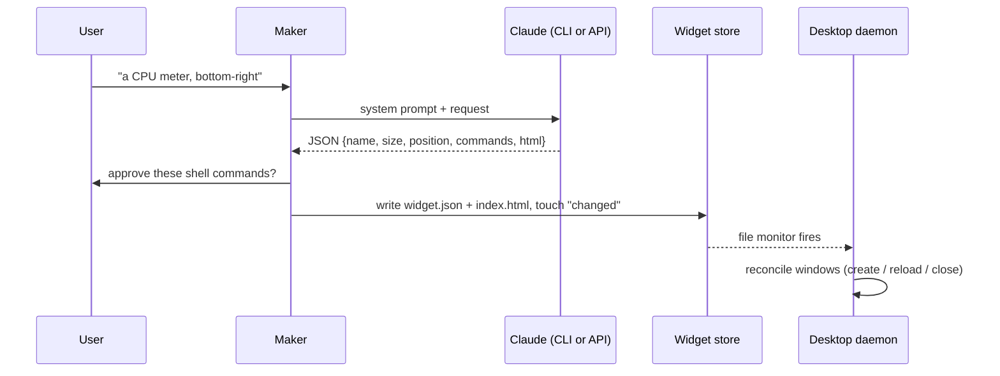

# Architecture

Pickit runs as two processes that communicate only through files:

| Process | Command | Job |
|---|---|---|
| **Maker** | `pickit` | The window where you describe, preview, refine and place widgets. It writes widget files and exits when you close it. |
| **Desktop daemon** | `pickit run` | Owns every widget window. It starts at login (XDG autostart) and whenever the maker opens, and keeps running with or without the maker. |

Both are unique `Gtk.Application`s, so launching one that is already running just activates the existing instance. The IDs are `io.github.dengo07.Pickit` and `io.github.dengo07.Pickit.Desktop`.

## Modules (`pickit/`)

| Module | Responsibility |
|---|---|
| `__main__.py` | CLI entry. Routes `run`/`stop` to the daemon and everything else to the maker. Sets `GDK_BACKEND=x11` and `WEBKIT_DMABUF_RENDERER_FORCE_SHM=1`. |
| `app.py` | Maker window: prompt, examples, generation thread, preview, approval, settings. |
| `daemon.py` | Desktop daemon: watches the store and reconciles windows; handles the widget context-menu actions. |
| `widget_window.py` | `WidgetView` (WebKit view with the JS bridge) and `WidgetWindow` (the desktop window: dock type, keep-below, sticky, transparency, manual drag, context menu, position saving). |
| `bridge.py` | The `window.widget` JS API and `CommandRunner`, which runs approved commands on their intervals in threads. |
| `generator.py` | Builds the prompt, extracts and validates the JSON spec, and retries once with the error fed back. |
| `backends.py` | `ClaudeCLIBackend` (`claude -p --output-format json --tools ""`) and `AnthropicBackend` (Python SDK, streaming, adaptive thinking). |
| `store.py` | Widget files, the change stamp, approval hashes and content signatures. |
| `runtime.py` | Detects source, Flatpak or AppImage; handles host command wrapping (`flatpak-spawn --host`), self-launching and locating the Claude CLI. |
| `autostart.py` | Launches the daemon detached, writes the XDG autostart entry, and adds the AppImage's menu entry. |
| `config.py` | `~/.config/pickit/config.json`. |
| `prompts/system.md` | The system prompt: the widget contract, the bridge API and design rules. |

## Key decisions

**Dock window type plus keep-below.** On EWMH window managers this puts a window in the "bottom" layer: above the desktop background and icons, below every normal window. Show Desktop doesn't hide it, and clicking it never raises it. A `DESKTOP`-type window was rejected because it gets buried under Nemo, Nautilus or Caja's desktop window as soon as the desktop is clicked. The trade-off: window managers don't move dock windows, so Pickit implements dragging itself (polling the pointer while the button is held), and dock windows don't take keyboard focus.

**Files as the IPC channel.** Every change is written to the store and then signalled by atomically replacing `~/.local/share/pickit/changed`. The daemon watches that one file and diffs a content signature per widget that ignores position. There is no D-Bus API to keep in sync, and hand-edited widgets work too.

**Approval by hash.** A widget's `approved_hash` is the SHA-256 of its canonicalised `commands`. Any change to a command, including one made by the model during a refine, invalidates the approval.

**Same data everywhere.** Inside Flatpak the XDG variables point into the sandbox, so `runtime.py` uses the real `~/.config` and `~/.local/share` there. The manifest grants access to just those folders. The source, Flatpak and AppImage versions therefore all share widgets, settings and the autostart entry.

**NVIDIA.** WebKit's GPU buffer sharing (DMABuf/GBM) fails on NVIDIA's proprietary driver, especially under Flatpak, and leaves windows blank. Pickit sets `WEBKIT_DMABUF_RENDERER_FORCE_SHM=1`, which keeps WebKit's normal renderer but hands frames over through shared memory. It deliberately doesn't use `WEBKIT_DISABLE_DMABUF_RENDERER`: in WebKit 2.54+ (the Flatpak's GNOME 51 runtime) that legacy path mis-draws composited layers, so shadows, rounded cards and animated elements vanish.

**One web process for all widgets.** Every WebKit view normally gets its own web process, which accounts for most of a widget's memory. Desktop widgets are created as "related views" of each other, so they share one process: about 40% less memory for a typical setup. The trade-off is that a crash or hang in that process restarts every widget, which the crash handler and watchdog do automatically. The maker's preview uses its own process.

**WebKit transparency.** Transparent WebKit pixels don't blend with parent GTK widgets. They punch through to whatever is behind the top-level window. Desktop widgets rely on exactly that. The maker's preview instead gives WebKit an opaque background matching the preview area.
