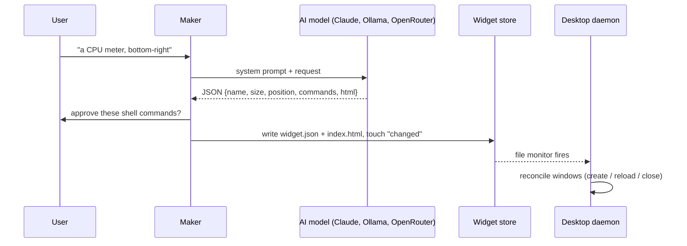

# Architecture

Pickit runs as two processes that communicate only through files:

| Process | Command | Job |
|---|---|---|
| **Maker** | `pickit` | The window where you describe, preview, refine and place widgets. It writes widget files and exits when you close it. |
| **Desktop daemon** | `pickit run` | Owns every widget window. It starts at login (XDG autostart) and whenever the maker opens, and keeps running with or without the maker. |

Both are unique `Gtk.Application`s, so launching one that is already running just activates the existing instance. The IDs are `io.github.dengo07.Pickit` and `io.github.dengo07.Pickit.Desktop`.

## Modules (`pickit/`)

| Module | Responsibility |
|---|---|
| `__main__.py` | CLI entry. Routes `run`/`stop` to the daemon and everything else to the maker. Sets `GDK_BACKEND=x11` and `WEBKIT_DMABUF_RENDERER_FORCE_SHM=1`. |
| `app.py` | Maker window: prompt, examples, generation thread, preview, approval, settings. |
| `daemon.py` | Desktop daemon: watches the store and reconciles windows; handles the widget context-menu actions. |
| `widget_window.py` | `WidgetWindow`, the desktop window shared by both engines: dock type, keep-below, sticky, transparency, manual drag, context menu, position saving. `make_view()` creates the engine's view with a lazy import. |
| `native/spec.py` | The native component vocabulary and its validator: a strict property whitelist per component, safe CSS values, precise error paths. |
| `native/data.py` | Data binding: command output parsing, templates, filters, conditions and choices, all in a small interpreter with no `eval`. |
| `native/render.py`, `native/draw.py` | `NativeView`: builds GTK widgets from the tree, turns data-dependent properties into bindings that update only when their inputs change, and draws rings, bars, sparklines and rounded images with Cairo. |
| `html_view.py` | `WidgetView`: the HTML engine's WebKit view, with the JS bridge, a shared web process, crash reload and watchdog. Only imported when an HTML widget exists. |
| `bridge.py` | The `window.widget` JS API and `CommandRunner`, which runs approved commands on their intervals in threads. |
| `generator.py` | Builds the prompt, extracts and validates the JSON spec, and retries once with the error fed back. |
| `backends.py` | `ClaudeCLIBackend` (`claude -p --output-format json --tools ""`), `AnthropicBackend` (Python SDK, streaming, adaptive thinking), `OllamaBackend` (`/api/chat` with JSON output, thinking off, and a context of 16k tokens or more) and `OpenRouterBackend` (OpenAI-style chat completions, JSON mode when the model supports it). The last two use only the standard library. `resolve_auto()` picks the first backend that's set up. |
| `store.py` | Widget files, the change stamp, approval hashes and content signatures. |
| `runtime.py` | Detects source, Flatpak or AppImage; handles host command wrapping (`flatpak-spawn --host`), self-launching and locating the Claude CLI. |
| `autostart.py` | Launches the daemon detached, writes the XDG autostart entry, and adds the AppImage's menu entry. |
| `config.py` | `~/.config/pickit/config.json`. |
| `prompts/system.md`, `prompts/native_examples/` | The system prompt: engine choice, the native component reference, the HTML contract, command and design rules, plus complete native examples. |

## Key decisions

**Two engines, native first.** WebKit costs about 50–150 MB per page process, while the same widgets drawn with GTK cost a few MB. So the AI describes most widgets as a declarative component tree (`ui.json`) that Pickit renders natively, and falls back to HTML only for designs the components can't express. Measured with five typical widgets (clock, battery ring, meters, weather, media): **24 MB** as native widgets (27 MB in the Flatpak), versus 180–244 MB for four HTML widgets. A declarative tree was chosen over having the AI write GTK code, because generated code would run with the user's full permissions, while a tree is data: it's validated against a whitelist and rendered by trusted code, and only approved commands ever run. WebKit is imported lazily, so a native-only desktop never loads it; mixing in one HTML widget brings its cost back.

**Dock window type plus keep-below.** On EWMH window managers this puts a window in the "bottom" layer: above the desktop background and icons, below every normal window. Show Desktop doesn't hide it, and clicking it never raises it. A `DESKTOP`-type window was rejected because it gets buried under Nemo, Nautilus or Caja's desktop window as soon as the desktop is clicked. The trade-off: window managers don't move dock windows, so Pickit implements dragging itself (polling the pointer while the button is held), and dock windows don't take keyboard focus.

**Files as the IPC channel.** Every change is written to the store and then signalled by atomically replacing `~/.local/share/pickit/changed`. The daemon watches that one file and diffs a content signature per widget that ignores position. There is no D-Bus API to keep in sync, and hand-edited widgets work too.

**Any model, same contract.** Every backend gets the same system prompt and must return the same JSON spec, which the generator validates. Nothing a backend returns is trusted: a bad spec gets fed back as an error for a repair attempt (two for Ollama, since small local models slip more often), and commands still need approval. Ollama's default context window (often 4k tokens) would silently cut off Pickit's ~8k-token instructions, so requests set `num_ctx` to at least 16k, more when refining a large widget. They also turn off "thinking": with `qwen3.5:9b` it took as long and produced much smaller widgets.

**Approval by hash.** A widget's `approved_hash` is the SHA-256 of its canonicalised `commands`. Any change to a command, including one made by the model during a refine, invalidates the approval.

**Same data everywhere.** Inside Flatpak the XDG variables point into the sandbox, so `runtime.py` uses the real `~/.config` and `~/.local/share` there. The manifest grants access to just those folders. The source, Flatpak and AppImage versions therefore all share widgets, settings and the autostart entry.

**NVIDIA.** WebKit's GPU buffer sharing (DMABuf/GBM) fails on NVIDIA's proprietary driver, especially under Flatpak, and leaves windows blank. Pickit sets `WEBKIT_DMABUF_RENDERER_FORCE_SHM=1`, which keeps WebKit's normal renderer but hands frames over through shared memory. It deliberately doesn't use `WEBKIT_DISABLE_DMABUF_RENDERER`: in WebKit 2.54+ (the Flatpak's GNOME 51 runtime) that legacy path mis-draws composited layers, so shadows, rounded cards and animated elements vanish.

**One web process for all widgets.** Every WebKit view normally gets its own web process, which accounts for most of a widget's memory. Desktop widgets are created as "related views" of each other, so they share one process: about 40% less memory for a typical setup. The trade-off is that a crash or hang in that process restarts every widget, which the crash handler and watchdog do automatically. The maker's preview uses its own process.

**WebKit transparency.** Transparent WebKit pixels don't blend with parent GTK widgets. They punch through to whatever is behind the top-level window. Desktop widgets rely on exactly that. The maker's preview instead gives WebKit an opaque background matching the preview area.
